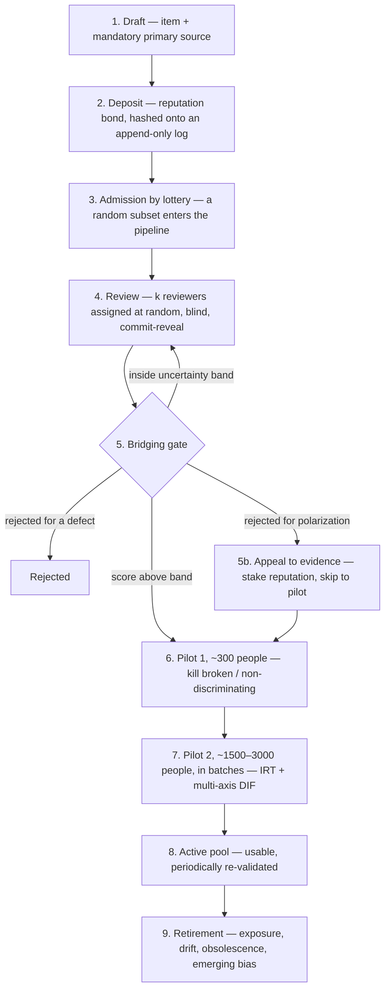

# Isegoria

**A distributed network for producing and validating quiz questions, where no
single authority decides what counts as a fair question.**

*Isegoria* (ἰσηγορία) was the ancient Athenian principle of the equal right of
every citizen to speak in the assembly.

> **Status:** a reference implementation. The scoring engine reproduces its reference
> simulations bit for bit, but the working paper in [`paper/`](paper/) showed that the
> bridge score on master is batch-relative and partly majoritarian (paper §3.3–3.4): with
> unequal camps it favours the question the larger camp likes. The corrections
> (`docs/01` D32–D41) are decided and are the first phase of the
> [roadmap](docs/10-roadmap.md): mathematics first, then the P2P network, then the rest.
> The identity, network and protocol layers are working, tested scaffolds with the heavy
> cryptography and transport behind clean plug points. See
> [Project status](#project-status).

---

## Table of contents

- [In plain words](#in-plain-words)
- [A step deeper](#a-step-deeper)
- [What it deliberately does *not* solve](#what-it-deliberately-does-not-solve)
- [Code architecture](#code-architecture)
- [Try it](#try-it)
- [Documentation](#documentation)
- [Project status](#project-status)
- [License](#license)

---

## In plain words

*(No technical background needed for this section.)*

### The problem

Imagine we want a big, trustworthy set of quiz questions — say, questions about
how your country's institutions actually work. Who gets to decide which questions
are **fair** and **good**?

- If the **government** decides, it can quietly pick questions that make it look
  good.
- If we just let people **vote** on which questions are good, then whichever side
  has the most votes controls the questions — the problem just moves from the
  government to the biggest crowd.

So the hard part isn't collecting questions. It's deciding which ones are fair
**without trusting any single boss, and without it becoming a popularity contest.**

### The idea

Isegoria decides a question is good using **two checks in a row**, not a vote.

**Check 1 — "Do people across the divide agree it's good?"**
A question doesn't pass just because *a lot* of people like it. It passes only if
people **from different sides** like it.

> Think of a film that both the action-movie critics *and* the art-house critics
> praise. That agreement across very different tastes is a strong sign the film is
> genuinely good — not just pandering to one crowd. A film only one camp loves
> gets filtered out.

*Where the code stands:* today's version of Check 1 still leans towards the larger
camp — when the camps are very unequal, a question only the majority likes can scrape
through. The fix is designed and is the first item of the [roadmap](docs/10-roadmap.md).

**Check 2 — "Does the question actually work when we try it?"**
The questions that survive Check 1 are tried out on real people, and we **measure**
what happens — no opinions involved:

- Does the question actually tell apart people who know the subject from people
  who don't? (A question everyone gets right, or everyone gets wrong, measures
  nothing.)
- Does it secretly favour one group over another **even when they know the subject
  equally well**? If a question is worded so that one side "gets it" instantly and
  the other has to decode it, it's measuring which side you're on, not what you
  know. That question is thrown out.

> Think of testing a thermometer. You don't take a poll on whether it *looks*
> accurate — you check it against reality. Check 2 is the reality check.

The whole point: the final decision is about **what the question does**, measured
in data, not about **what the network thinks** — and that's far harder to rig.

### "Anonymous, but one person = one voice"

Everyone takes part **anonymously** — no names, no political affiliation, nothing.
But the system still guarantees that behind each anonymous participant there is
**exactly one real person**, so nobody can create an army of fake accounts to tilt
the results.

> Think of a masked ball. At the door, a guard checks your ID to make sure one
> real person gets one mask. But once you're inside, nobody — not even the guard —
> can tell which mask is you.

Crucially, the guard (the ID check, e.g. a national digital ID) and the party
organiser (who hands out the anonymous "mask") are **different parties who never
compare notes**. That separation is what keeps the state from linking a person to
what they do.

### No money, ever

There is **no token, no stake, no payment** to take part. Paying to participate
would just recreate rule-by-the-wealthy — the very thing we're trying to avoid.
The only "cost" of proposing questions is your **reputation** and a rate limit.

---

## A step deeper

*(Still conceptual, a bit more precise. The full specification lives in
[`docs/`](docs/).)*

### Two levels

| | **Level A — Opinion** | **Level B — Evidence** |
|---|---|---|
| Input | Peer reviews from nodes | Real answers from samples of people |
| Question asked | "Does this look like a good item?" | "Does this item behave well?" |
| Attackable? | Yes, with coalitions | Very hard: you'd have to corrupt the sample |
| Role | Upstream filter | Final verdict |

Level A ("bridging") is essentially an **anti-spam filter for partisan items**.
The real verdict is Level B, computed from response data with standard
psychometrics (Item Response Theory + Differential Item Functioning).

### The three actions

Each person can do three things, each under a **separate, unlinkable pseudonym**:

- **Propose** — write a new question.
- **Judge** — peer-review other people's questions (this is the "voting" of the
  original idea).
- **Answer** — act as a test subject so new questions can be trialled against real
  data.

### The lifecycle of a question



- **Nobody chooses what to review** (prevents brigading).
- **Nobody sees the author** (prevents voting on the person).
- **Nobody sees others' judgments before committing their own** (prevents cascades).
- The **appeal** branch is the key correction: a *true but politically divisive*
  fact produces the same voting pattern as one-sided propaganda, so bridging would
  wrongly kill it. The appeal lets the author send it straight to the data-based
  filter, at the cost of their reputation, refunded if the psychometrics vindicate
  the item.

### Reputation: two separate scores, never combined

- **Author score `C_a`** — how good your proposed questions turn out to be;
  it only controls your **rate limit** on new proposals.
- **Evaluator score `E_u`** — how good your reviews are; it **weights your review
  vote**.

They live on **different, unlinkable pseudonyms** and are never merged. The
evaluator score uses a *proper scoring rule*: you gain reputation only by being
**right when the crowd is wrong** — simply following the majority scores zero. In a
system meant to resist capture by the majority, the correct dissenter must be
rewarded structurally.

### Anti-collusion

A cartel that votes as a block is detected by the correlation of its behaviour, and
its combined weight is discounted **sub-linearly**: 500 coordinated nodes count
for about √500 ≈ 22 independent ones.

### Anonymous identity

Uniqueness is established by an external ID (national eID / CIE / SPID) that is
**cryptographically severed** from everything you then do. Each role's pseudonym is
derived deterministically, so it is **not rotatable** — you cannot burn a bad
reputation and start fresh (no "whitewashing").

### Tamper-proof storage without a blockchain

Questions and votes live on **signed, append-only logs** replicated across a
diverse consortium, made durable with **erasure coding** and periodically
**anchored** to a public chain. There is no heavy global consensus: the security
comes from operator **diversity** and from the fact that the scoring computation is
**reproducible** — anyone can re-run it and catch a dishonest signer.

---

## What it deliberately does *not* solve

Honest, structural limits (not bugs):

1. **True-but-divisive false negatives.** Bridging cannot tell a true polarizing
   fact from partisan propaganda; no threshold fixes this. Mitigation: the appeal
   channel.
2. **Pool-level bias.** Every item can pass the fairness test while the *choice of
   topics* is still skewed. Mitigation: fixed per-domain coverage quotas, set by
   lottery.
3. **The elite blind spot.** An item can be neutral on the political axis yet
   biased on a socio-economic one. Mitigation: multi-axis DIF, which must be looked
   for actively.
4. **"Competence" is still a construct someone chooses.** The psychometrics verify
   an item measures *one thing* coherently, not that it's the *right* thing.
5. **The consortium's initial selection has no purely technical fix.** It's a human
   trust decision, made survivable (not fatal) by reproducible computation and the
   freedom to fork.

See [`docs/06-threat-model.md`](docs/06-threat-model.md) for the full threat
model.

---

## Code architecture

A Rust Cargo workspace. The scoring engine is isolated in a crate with **no
dependency on identity or network** — it runs offline and is reproducible
*in a way the compiler enforces*.

| Crate | Role | Status |
|---|---|---|
| [`scoring`](crates/scoring) | Deterministic engine: bridging (A), IRT/DIF (B), reputation (C), anti-collusion | **Complete**, validated against `sim/` |
| [`identity`](crates/identity) | Anonymous enrollment: source adapters, threshold-issued credential, role nullifiers | Scaffold + real mechanisms (single-server + threshold OPRF label, single + threshold BBS+ blind credential, ZK nullifier) |
| [`network`](crates/network) | Content addressing, Merkle, transparency log, consortium checkpoints, erasure coding, anchoring | Scaffold + real integrity primitives (incl. OpenTimestamps proofs) |
| [`protocol`](crates/protocol) | Lifecycle orchestration: deposit, lottery, blind review, gate + appeal, pilot, honeypot | Scaffold, wires the three layers together |

The uniqueness label runs on a real single-server **VOPRF** (RFC 9497, via `voprf`)
*and* on a real **threshold** t-of-n OPRF (Shamir shares + per-share DLEQ over
Ristretto255), so no sub-threshold coalition can compute it; the anonymous credential
runs on real **BBS+** blind issuance (via `bbs_plus`), single-issuer *and* **threshold**
t-of-n (a DKG + base-OT + MPC signing protocol, so no `t-1` members can issue); each
per-role pseudonym carries a real Semaphore-style **ZK nullifier** proving it derives
from a valid credential (a sigma-protocol bound to the BBS+ credential — no
circom/Groth16 stack); and anchoring runs on the real **OpenTimestamps** proof format
(via `opentimestamps`). What remains is a real distributed key-generation ceremony and
transport for the two committees, the live network side of anchoring (a calendar server
and a Bitcoin block source), plus peer-to-peer transport (libp2p) and convergent state
(CRDT).
The rule throughout is *prefer mature,
audited libraries* behind clean traits; bespoke cryptography is a considered exception
— allowed when it serves the design, kept small, built on vetted primitives, and
tested — not the default.

For how the design maps onto the code, module by module, see
[`ARCHITECTURE.md`](ARCHITECTURE.md).

---

## Try it

```sh
cargo test --workspace                 # acceptance + property (proptest) + reproducibility + end-to-end
cargo clippy --workspace --all-targets
cargo llvm-cov --workspace --summary-only   # line coverage (~97%); needs cargo-llvm-cov
```

CI runs fmt, clippy (`-D warnings`), the full test suite, and coverage on every push
and pull request (`.github/workflows/ci.yml`).

The scoring tests run against **fixtures exported from the Python simulations** in
[`sim/`](sim/): the Rust engine must reproduce the simulations' results on the same
input. To regenerate the fixtures you need `numpy`/`scipy` (see `sim/`).

---

## Documentation

- **This README** — the layered overview above.
- **[`ARCHITECTURE.md`](ARCHITECTURE.md)** — design-to-code map, invariants, plug
  points, test strategy (English).
- **[`docs/`](docs/)** — the full conceptual specification:
  - [`00-overview.md`](docs/00-overview.md) — overview
  - [`01-decisions.md`](docs/01-decisions.md) — architectural decisions (ADR)
  - [`02-scoring-engine.md`](docs/02-scoring-engine.md) — the mathematical core
  - [`03-identity-enrollment.md`](docs/03-identity-enrollment.md) — identity
  - [`04-storage-network.md`](docs/04-storage-network.md) — storage & network
  - [`05-question-lifecycle.md`](docs/05-question-lifecycle.md) — lifecycle protocol
  - [`06-threat-model.md`](docs/06-threat-model.md) — threat model
  - [`07-verification-and-assurance.md`](docs/07-verification-and-assurance.md) — verification methodology
  - [`08-formal-specification.md`](docs/08-formal-specification.md) — independent audit: what is implemented, tested, still open
  - [`10-roadmap.md`](docs/10-roadmap.md) — **the development plan, by priority**
  - [`11-mutation-testing.md`](docs/11-mutation-testing.md), [`12-panic-audit.md`](docs/12-panic-audit.md) — test-quality reports
  - [`99-glossary.md`](docs/99-glossary.md) — glossary, from scratch
- **[`sim/`](sim/)** — the executable specification (research prototypes).
- **[`paper/`](paper/)** — working paper on the mathematics of the mechanism: formal statement,
  proofs, reproducible experiments and open problems ([PDF](paper/main.pdf)).

---

## Project status

| Layer | State |
|---|---|
| Scoring engine (A + B + C + anti-collusion) | Implemented, reproducible bit-for-bit, matches the sims; the bridge score is batch-relative and partly majoritarian until D32 (T49) |
| Design revisions from the working paper ([`paper/`](paper/)): side-balanced bridge score, proper evaluator score with exploration, DIF anchor precondition, residual-based coordination detection (`docs/01` D32–D41) | Decided; roadmap Phase 1, the first priority |
| Findings of the third review (2026-09-24): deposit replay, respondents not identity-gated, consortium threshold, appeal stake, band items without appeal (`docs/08` §0-quinquies) | Deposit replay (T64) and respondent gate (T65) fixed; the rest confirmed by tests on master and planned (`docs/10` T58–T67) |
| Identity, network, protocol | Working scaffolds; deterministic mechanisms + single-server & threshold OPRF label + single & threshold BBS+ credential + ZK nullifier + OpenTimestamps anchoring proofs real, remaining heavy crypto/transport behind traits |
| Real crypto/transport integration (committee DKG/transport, libp2p, live OpenTimestamps calendar/Bitcoin) | Future work |
| Meta-level governance (stratified sortition) | Future work |

**What comes next** ([`docs/10-roadmap.md`](docs/10-roadmap.md)), in order:

1. **Mathematics** — the two severe defects are fixed (a replayed deposit drained its
   author's quota, T64; one person could fill a Level B sample, T65); then
   correct the mechanism (D32–D41) and the paths after the gate (band re-decision with
   extra reviewers, appeal for band items, appeal stake), make the engine reject
   malformed input, and characterize the thresholds.
2. **P2P network** — persistence, transport and replication, a randomness beacon nobody
   can grind, live anchoring.
3. **The rest** — the protocol boundary (no-show reviewers, validated panels, honeypot
   sampling), distributed identity and the external cryptographic review, statistical
   privacy, real-world pilots.

This is a research/specification-stage project. Nothing here is production-ready
security; the cryptographic plug points are explicitly non-production.

**Scale.** The evidence filter needs ~1,500–3,000 distinct respondents per validation
batch, so the network has a floor: below ~2,000 active participants it cannot run as
specified, and anonymity itself weakens in a small crowd. See
[`docs/02-scoring-engine.md`](docs/02-scoring-engine.md) §B.6.

---

## License

[EUPL-1.2](LICENSE).
